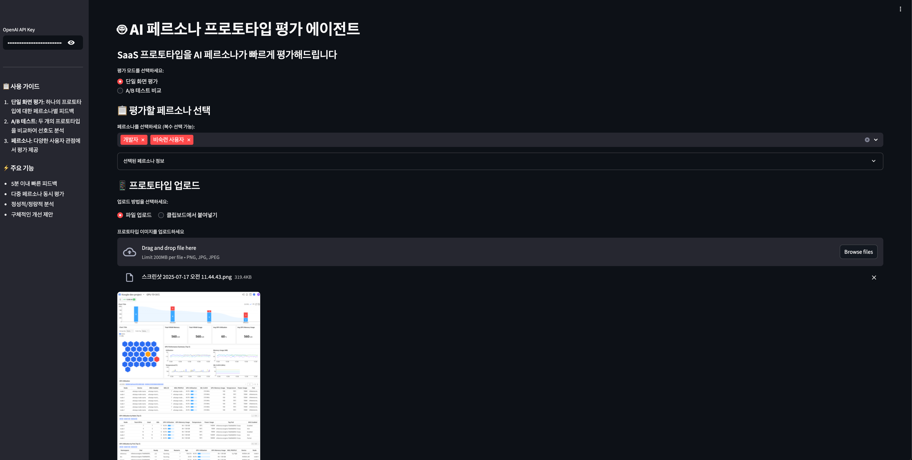
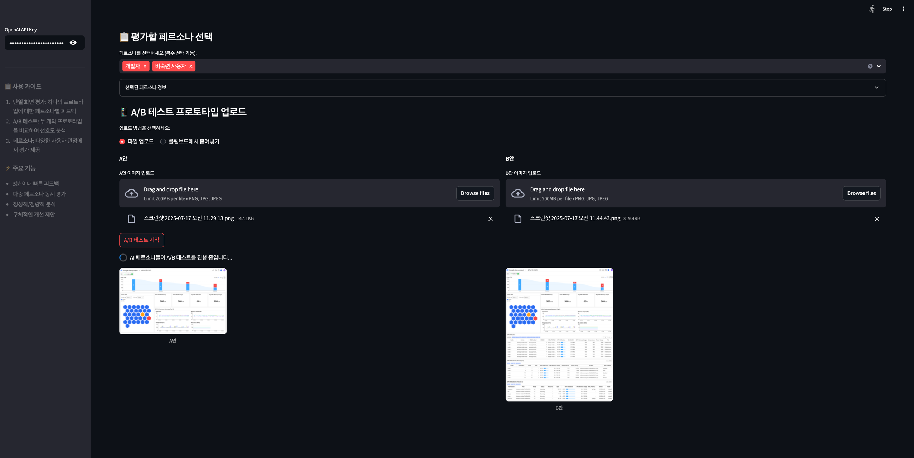

# 🤖 AI 페르소나 프로토타입 평가 에이전트

SaaS 프로토타입을 AI 페르소나가 빠르게 평가해주는 MVP 서비스입니다.

## 질답 요약
[question.md](question.md)


## 화면 예시

단일 화면 평가


A/B 테스트


## 📋 개요

이 서비스는 다음과 같은 문제를 해결합니다:
- **시간 소모**: 기존 사용자 리서치는 수일~수주 소요 → **5분 이내 피드백**
- **높은 비용**: 건당 50만원 이상 → **건당 1만원 이하**
- **초기 검증의 어려움**: 객관적 데이터 없이 직관에 의존 → **데이터 기반 의사결정**

## ⚡ 주요 기능

### P0 (MVP 핵심 기능)
- **단일 화면 평가**: 하나의 프로토타입에 대한 페르소나별 정성적 피드백
- **A/B 테스트**: 두 개의 프로토타입 비교 및 선호도 분석
- **다중 페르소나**: 5가지 기본 페르소나 동시 평가
- **즉시 결과**: 웹 대시보드에서 실시간 결과 확인
- **네이티브 클립보드 지원**: 파일 업로드 외에 Ctrl+V로 직접 이미지 붙여넣기 가능

### 기본 페르소나 라이브러리
1. **개발자**: 기술적 세부사항과 효율성 중시
2. **기획자**: 사용자 경험과 비즈니스 가치 균형 고려
3. **비숙련 사용자**: 직관적이고 간단한 인터페이스 선호
4. **디자이너**: 시각적 일관성과 사용자 경험 중시
5. **마케터**: 전환율과 사용자 참여도 중시

## 🚀 빠른 시작

### 1. 환경 설정

```bash
# 저장소 클론
git clone <repository-url>
cd persona

# 의존성 설치
pip install -r requirements.txt
```

### 2. API 키 설정

OpenAI API 키가 필요합니다:
1. [OpenAI Platform](https://platform.openai.com/)에서 API 키 발급
2. 애플리케이션 실행 후 사이드바에 API 키 입력

### 3. 애플리케이션 실행

```bash
streamlit run app.py
```

브라우저에서 `http://localhost:8501`로 접속

## 📱 사용 방법

### 단일 화면 평가
1. **페르소나 선택**: 평가받고 싶은 페르소나들을 선택
2. **이미지 입력**: 
   - **파일 업로드**: 프로토타입 이미지 파일(PNG, JPG) 업로드
   - **네이티브 클립보드**: 이미지 복사 후 붙여넣기 영역 클릭하고 Ctrl+V (또는 드래그 앤 드롭)
3. **평가 시작**: 버튼 클릭 후 5분 이내 결과 확인
4. **결과 분석**: 페르소나별 점수, 장단점, 개선 제안 검토

### A/B 테스트
1. **페르소나 선택**: 비교 평가할 페르소나들 선택
2. **A/B 이미지 입력**:
   - **파일 업로드**: 비교할 두 개의 프로토타입 파일 업로드
   - **네이티브 클립보드**: A안, B안 이미지를 각각 복사 후 해당 영역 클릭하고 Ctrl+V
3. **테스트 시작**: A/B 테스트 실행
4. **비교 결과**: 페르소나별 선호도와 선택 이유 분석

## 🎯 사용자 시나리오

### 시나리오 1: 신규 기능 A/B 테스트
> **상황**: 요금제 안내 페이지의 A안과 B안 중 선택 필요  
> **방법**: 두 디자인을 업로드하고 '가격 민감형', '기능 중시형' 페르소나로 평가  
> **결과**: 각 페르소나별 선호도와 구체적인 선택 이유 확인

### 시나리오 2: 단일 화면 사용성 검증
> **상황**: 회원가입 화면의 사용성 문제점 사전 발견 필요  
> **방법**: 스케치 단계 이미지를 'IT 비숙련자' 페르소나로 평가  
> **결과**: 잠재적 사용성 문제와 개선 방향 제시

### 시나리오 3: 팀 내 의사결정 지원
> **상황**: 디자인 결정에 대한 객관적 근거 필요  
> **방법**: AI 평가 결과를 팀원들과 공유  
> **결과**: 데이터 기반 설득과 빠른 합의 도출

## 🔧 기술 스택

- **Frontend**: Streamlit (Python 웹 프레임워크)
- **AI Model**: OpenAI GPT-4 Vision Preview
- **Image Processing**: Pillow (PIL)
- **Deployment**: 로컬 실행 (향후 클라우드 배포 예정)

## 📊 성능 지표

| 지표 | 기존 방식 | AI 페르소나 방식 | 개선율 |
|------|-----------|------------------|--------|
| 피드백 수집 시간 | 평균 1주 | 5분 이내 | **99% 단축** |
| 프로토타입당 비용 | 50만원+ | 1만원 이하 | **98% 절감** |
| 주간 테스트 횟수 | 0.5회 | 5회+ | **10배 증가** |

## ⚠️ 제한사항

- **AI 한계**: 실제 사용자 반응을 100% 대체할 수 없음
- **보조 도구**: 최종 의사결정이 아닌 의사결정 지원 도구로 활용
- **API 의존성**: OpenAI API 성능 및 비용 정책에 영향받음

## 🛣️ 향후 계획

### P1 (Should-Have)
- **커스텀 페르소나**: 사용자 정의 페르소나 생성 기능
- **다국어 지원**: 영문 프로토타입 평가 및 피드백
- **피드백 구체화**: 추가 질문(Follow-up) 기능

### P2 (Nice-to-Have)
- **사용자 여정 테스트**: 다중 화면 플로우 평가
- **Slack/Jira 연동**: 알림 및 티켓 생성 자동화
- **예측 히트맵**: 시선 추적 예측 시각화

## 📞 지원

문제가 발생하거나 개선 제안이 있으시면 이슈를 등록해주세요.

## 📄 라이선스

이 프로젝트는 MIT 라이선스 하에 배포됩니다.

---

**개발자**: 김재영  
**버전**: 1.0 (MVP)  
**최종 업데이트**: 2025년 7월 17일